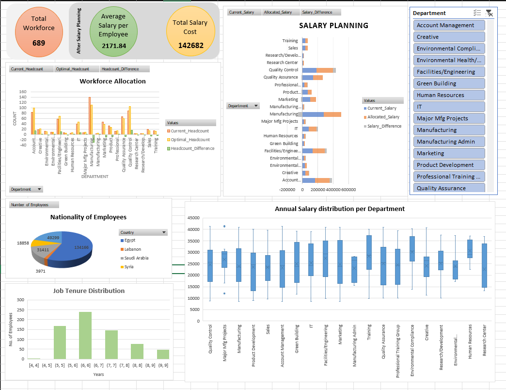

# Workforce Optimization & Salary Planning Dashboard (Excel)

## 📌 Project Overview
This project analyzes employee data to optimize workforce allocation and support salary planning decisions using Excel Solver and What-If Analysis tools.

## 📊 Dataset
- Employee dataset containing role, department, salary, performance metrics, and workforce constraints.

## 🛠 Tools & Techniques
- Microsoft Excel
- Solver Add-in (Optimization)
- What-If Analysis
- Pivot Tables & Charts

## 🎯 Business Objectives
- Optimize workforce allocation while minimizing total salary cost
- Support management decisions using scenario-based analysis
- Identify cost-efficient staffing strategies

## 📈 Key Features
- Workforce optimization using Excel Solver
- Scenario analysis using What-If Analysis
- Interactive dashboard with summary KPIs

## 🔍 Key Insights
- Optimal workforce allocation reduced overall salary cost while meeting staffing requirements
- Certain departments showed over-allocation under current staffing
- Scenario-based planning helps management evaluate multiple salary strategies

## 🖼 Dashboard Preview

